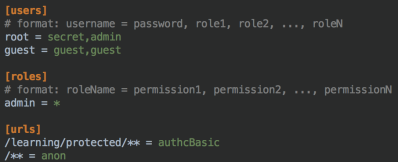
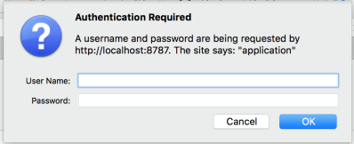

# Learning

## Commands to start project
    - `npm install`
    - copy (do not rename) sample-learning.yml to learning.yml in the same directory.
    - Change learning.yml to match your environment.
    - From the *root* learning directory compile : `mvn clean compile` 
    - To start the project : `mvn exec:exec -pl learning-service`
    - Access project using : `http://localhost:8787`
    - Access swagger UI : `http://localhost:8787/learning/swagger`

## Dropwizard - REST - SWAGGER - shiro

### REST
    - @Path("/sample")
    - @GET
    - @POST
    - @PathParam
    - @QueryParam
    - @Consumes(MediaType.APPLICATION_FORM_URLENCODED)
    - @FormParam

### Swagger
    - http://docs.swagger.io/swagger-core/apidocs/index.html
    - @Api("/[path]") : Marks a class as a Swagger resource.
    - @ApiOperation("Sample endpoint") : Describes an operation or typically a HTTP method against a specific path.
    - @ApiParam("name") : Adds additional meta-data for operation parameters.

## shiro
    - authcBasic

Project is created using - https://github.com/rayokota/generator-angular-dropwizard
